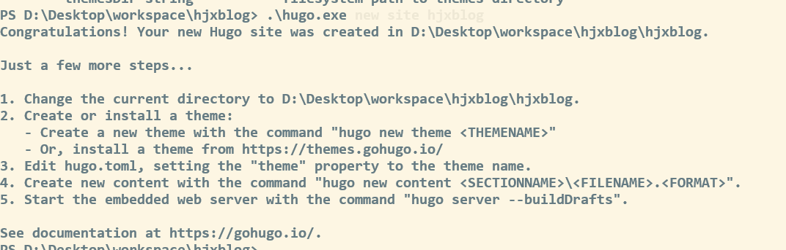
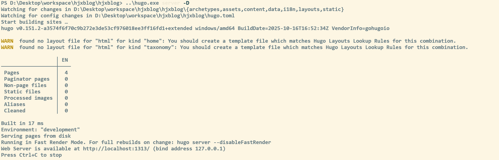
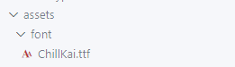
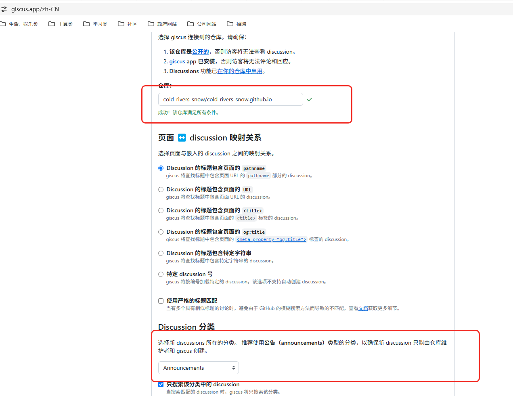
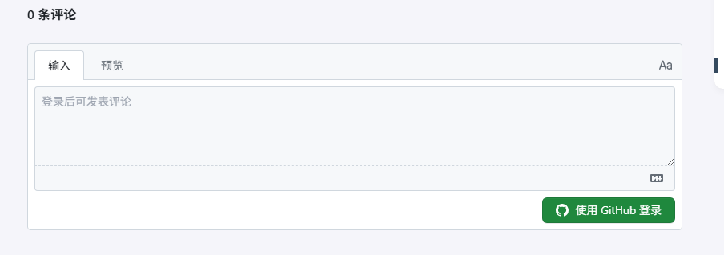
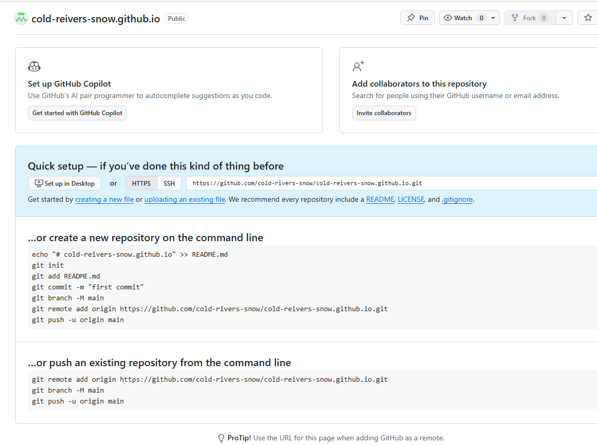
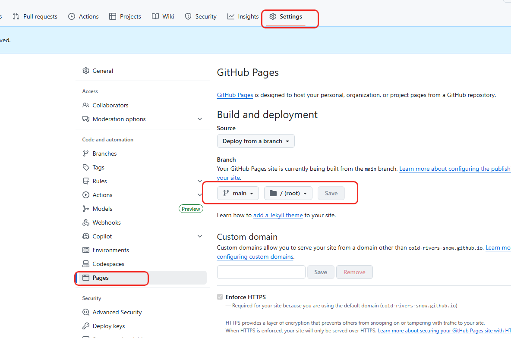
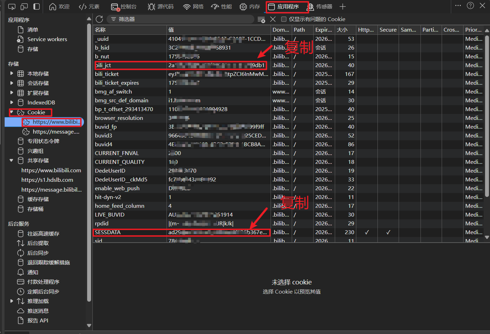
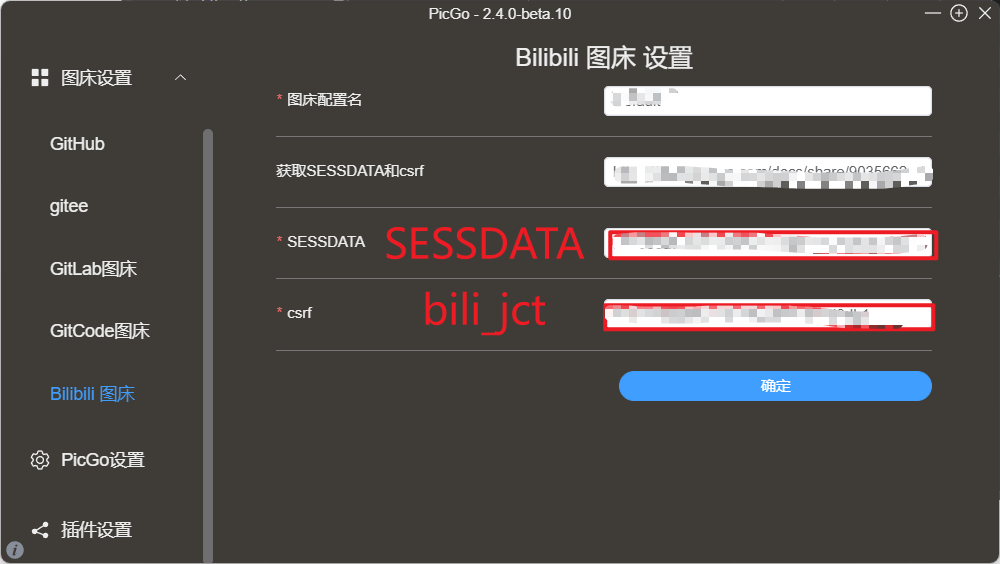
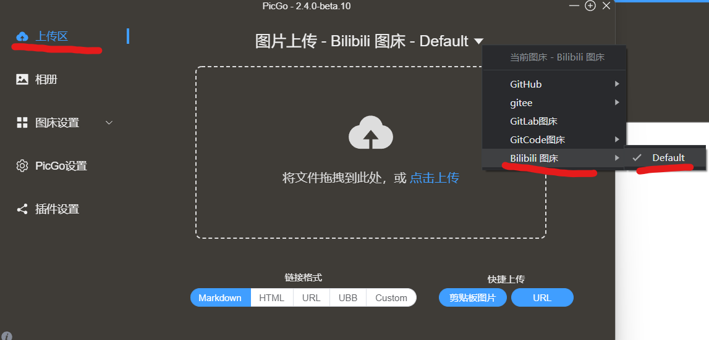

## Hugo

### 简介

[下载地址]([https://github.com/gohugoio/hugo/tags](https://github.com/gohugoio/hugo/tags))

[hugo github]([https://github.com/gohugoio/hugo](https://github.com/gohugoio/hugo))

[官网]([https://gohugo.io/](https://gohugo.io/))

[官方文档](https://hugo.opendocs.io/)

 Go 语言编写的静态网站生成器，构建速度快。它拥有丰富的主题和强大的功能。

- extend 是模板继承的核心，通过 “父模板定义结构 + 子模板填充内容” 实现复用，适合统一布局的页面。
- 非 extend 模板是独立的，通过 partial 或 template 手动组合，适合灵活的片段复用或独立页面。

这里下载带有 extend 的安装包 如：[hugo_extended_0.151.2_windows-amd64.zip](https://github.com/gohugoio/hugo/releases/download/v0.151.2/hugo_extended_0.151.2_windows-amd64.zip)

下载下来只有一个安装包二进制文件，README.md hugo 简介，LICENSE 协议

创建博客文件，用于存放博客内容

```plain
.\hugo.exe new site hjxblog
```



### Hugo 目录结构

[官方目录说明]([https://gohugo.io/getting-started/directory-structure/](https://gohugo.io/getting-started/directory-structure/))

默认生成的目录

```plain
.
├── archetypes
│   └── default.md
├── assets
├── content
├── data
├── i18n
├── layouts
├── static
├── resources
├── themes
└── config.toml

```

| 文件名称 | 简要说明 |
| --- | :---: |
| archetypes | 该文件夹主要用来存储博客生成的模板文件，初次使用只有一个default.md，可以根据个人的主题配置添加自定义头部信息 |
| assets | 该文件夹主要用于保存博客样式`css`和`js`文件，通过资源观点传递的全局资源 |
| content | 保存个人博客所有内容 |
| data | 保存生成站点时候所需要的配置文件，用于增强内容、配置、本地化和导航的数据文件 |
| i18n | 多语言站点的翻译表 |
| layouts | 以为`.html`形式存储模板，将你博客内容呈现为静态页面，包含将内容、数据和资源转换为完整网站的模板 |
| static | 存储所有静态内容：图片、`.css`、.`js`等，当使用 Hugo 生成静态页面时，构建站点时所有内容将会被复制到 public 目录文件 |
| themes | 保存主题，可以包含一个或多个，每个主题位于自己的子目录中 |
| hugo.toml | 个人博客主题样式配置文件 |

启动 服务

```plain
..\hugo.exe server -D
```



### 配置主题

Hugo 默认不带主题，因此你需要去 [主题社区](https://themes.gohugo.io/) 下载主题，本文下载 Stack 和PaperMod 测试主题

[Stack 文档]([https://stack.jimmycai.com/](https://stack.jimmycai.com/))

可以直接下载 release 版本 zip 包，加压到 theme 下，或者使用 submodule 方式直接 clone

```plain
git submodule add https://github.com/CaiJimmy/hugo-theme-stack/ themes/hugo-theme-stack
```

负责 stack 中的`exampleSite`样例数据中的 Content 和 hugo.yaml 复制到主文件夹中

要修改主题，你必须将想要修改的文件复制到`layouts`目录下的相同路径中。

例如，若要修改`themes/hugo-theme-stack/layouts/partials/header.html`文件，你需要将其复制到`layouts/partials/header.html`，并在那里进行修改（从主题的代码库中复制代码）。这一规则同样适用于`assets`和`static`目录。

修改根目录下的文件，可以替换多种主题，通过 git submoudle 方式可以修改主题中的内容，用于自己想要的开发。

然后修改 hugo.yaml 中的内容

[icons 官方地址](https://tabler.io/icons)

一篇博客文章的目录：

```plain
content
└── post
    └── my-first-post
        ├── index.md
        ├── image1.png
        └── image2.png
```

content 内容构造格式： [https://gohugo.io/content-management/sections/](https://gohugo.io/content-management/sections/)

短代码嵌入视频链接或代码片段 [https://stack.jimmycai.com/writing/shortcodes](https://stack.jimmycai.com/writing/shortcodes)

自定义菜单： [https://stack.jimmycai.com/config/menu](https://stack.jimmycai.com/config/menu)

#### 修改字体

下载 [100font]([https://www.100font.com/](https://www.100font.com/))

把字体文件放入assets/font下



将以下代码修改并复制到layouts/partials/footer/custom.html`文件中(文件不存在就自己创建)

    - **字体名**：给字体命名一个别名，随便填写就好，保持统一就行
    - **字体文件名**：字体文件的全名，带后缀名的，也就是 **xxx.ttf**

```plain
<style>
  @font-face {
    font-family: 'ChillKai';
    src: url({{ (resources.Get "font/ChillKai.ttf").Permalink }}) format('truetype');
  }

  :root {
    --base-font-family: 'ChillKai';
    --code-font-family: 'ChillKai';
  }
</style>
```

#### eye

[https://letere-gzj.github.io/hugo-stack/p/hugo/view-count/](https://letere-gzj.github.io/hugo-stack/p/hugo/view-count/)

#### 友链、归档多列显示

修改assets/scss/custom.scss`文件(不存在则自行创建)，引入以下css样式代码

```plain
@media (min-width: 1024px) {
  .article-list--compact {
    display: grid;
    // 目前是两列，如需三列，则后面再加一个1fr，以此类推
    grid-template-columns: 1fr 1fr;
    background: none;
    box-shadow: none;
    gap: 1rem;

    article {
      background: var(--card-background);
      border: none;
      box-shadow: var(--shadow-l2);
      margin-bottom: 8px;
      margin-right: 8px;
      border-radius: 16px;
    }
  }
}

```

#### 文章目录折叠&展开

将以下代码复制到layouts/partials/footer/custom.html文件中

```plain
<style>
    #TableOfContents > ul, ol {
        ul, ol {
            display: none;
        }
        .open {
            display: block;
        }
    }
</style>

<script>
    function initTocHide() {
        // 判断是否存在文章目录
        let toc = document.querySelector(".widget--toc");
        if (!toc) {
            return;
        }
        // 监听滚动
        window.addEventListener('scroll', function() {
            //清除class值
            let openUl = document.querySelectorAll(".open");
            if (openUl.length > 0) {
              openUl.forEach((ul) => {
                ul.classList.remove("open")
              })
            }
            // 获取active-class
            let currentLi = document.querySelector(".active-class");
            if (!currentLi) {
                return
            }
            // 展示子ul
            if (currentLi.children.length > 1) {
                currentLi.children[1].classList.add("open")
            }
            // 展示父ul
            let ul = currentLi.parentElement;
            do {
                ul.classList.add("open");
                ul = ul.parentElement.parentElement
            } while (ul !== undefined && (ul.localName === 'ul' || ul.localName === 'ol'))
        });
    }
    initTocHide()
</script>

```

#### 返回顶页按钮

[https://icon-icons.com/zh/](https://icon-icons.com/zh/)

准备一张[返回顶部图片](https://letere-gzj.github.io/hugo-stack/p/hugo/custom-stack-theme/backTop.svg)，放到assets/icons`文件夹下

将以下代码复制到layouts/partials/footer/custom.html`文件中

```plain
<style>
    #backTopBtn {
        display: none;
        position: fixed;
        bottom: 30px;
        z-index: 99;
        cursor: pointer;
        width: 30px;
        height: 30px;
        background-image: url({{ (resources.Get "icons/backTop.svg").Permalink }});
    }
</style>

<script>
    /**
     * 滚动回顶部初始化
     */
    function initScrollTop() {
        let rightSideBar = document.querySelector(".right-sidebar");
        if (!rightSideBar) {
            return;
        }
        // 添加返回顶部按钮到右侧边栏
        let btn = document.createElement("div");
        btn.id = "backTopBtn";
        btn.onclick = backToTop
        rightSideBar.appendChild(btn)
        // 滚动监听
        window.onscroll = function() {
            // 当网页向下滑动 20px 出现"返回顶部" 按钮
            if (document.body.scrollTop > 20 || document.documentElement.scrollTop > 20) {
                btn.style.display = "block";
            } else {
                btn.style.display = "none";
            }
        };
    }

    /**
     * 返回顶部
     */
    function backToTop(){
        window.scrollTo({ top: 0, behavior: "smooth" })
    }

    initScrollTop();
</script>

```

#### 自定义MD引用块颜色模板

 创建文件layouts/_default/_markup/render-blockquote-alert.html`，并将以下代码复制进去

```plain
<blockquote class="alert alert-{{ .AlertType }}">
    {{ .Text | safeHTML -}}
</blockquote>
```

将以下代码复制进assets/scss/custom.scss`文件中

```plain
[data-scheme="light"] {
  .alert-note {
    --card-separator-color: #65bbee;
    --blockquote-background-color: #e7f2fa;
  }
  .alert-tip {
    --card-separator-color: #55aa55;
    --blockquote-background-color: #eeffee;
  }
  .alert-warn {
    --card-separator-color: #ffbb78;
    --blockquote-background-color: #ffeecc;
  }
  .alert-error {
    --card-separator-color: #cc3334;
    --blockquote-background-color: #ffeeef;
  }
}

[data-scheme="dark"] {
  .alert-note {
    --card-separator-color: #006699;
    --blockquote-background-color: #002234;
  }
  .alert-tip {
    --card-separator-color: #336733;
    --blockquote-background-color: #112310;
  }
  .alert-warn {
    --card-separator-color: #aa5501;
    --blockquote-background-color: #452300;
  }
  .alert-error {
    --card-separator-color: #880000;
    --blockquote-background-color: #450000;
  }
}

```

使用方法

+ 可选项：**NOTE** | **TIP** | **WARN** | **ERROR**
+ 可仿照上面css写法，自行添加新的css样式，来实现更多的可选项

```plain
> [!NOTE]
> 这是markdown的引用块语法
```

#### 代码块过长折叠&展开

准备一张[向下展开图片](https://letere-gzj.github.io/hugo-stack/p/hugo/custom-stack-theme/codeMore.png)(**Ctrl**+**S**保存)，放到assets/icons`目录下

将以下代码复制进layouts/partials/footer/custom.html`

```plain
<style>
    .highlight {
        /* 你可以根据需要调整这个高度 */
        max-height: 400px;
        overflow: hidden;
    }

    .code-show {
        max-height: none !important;
    }

    .code-more-box {
        width: 100%;
        padding-top: 78px;
        background-image: -webkit-gradient(linear, left top, left bottom, from(rgba(255, 255, 255, 0)), to(#fff));
        position: absolute;
        left: 0;
        right: 0;
        bottom: 0;
        z-index: 1;
    }

    .code-more-btn {
        display: block;
        margin: auto;
        width: 44px;
        height: 22px;
        background: #f0f0f5;
        border-top-left-radius: 8px;
        border-top-right-radius: 8px;
        padding-top: 6px;
        cursor: pointer;
    }

    .code-more-img {
        cursor: pointer !important;
        display: block;
        margin: auto;
        width: 22px;
        height: 16px;
    }
</style>

<script>
  function initCodeMoreBox() {
    let codeBlocks = document.querySelectorAll(".highlight");
    if (!codeBlocks) {
      return;
    }
    codeBlocks.forEach(codeBlock => {
      // 校验是否overflow
      if (codeBlock.scrollHeight <= codeBlock.clientHeight) {
        return;
      }
      // 元素初始化
      // codeMoreBox
      let codeMoreBox = document.createElement('div');
      codeMoreBox.classList.add('code-more-box');
      // codeMoreBtn
      let codeMoreBtn = document.createElement('span');
      codeMoreBtn.classList.add('code-more-btn');
      codeMoreBtn.addEventListener('click', () => {
        codeBlock.classList.add('code-show');
        codeMoreBox.style.display = 'none';
        // 触发resize事件，重新计算目录位置
        window.dispatchEvent(new Event('resize'))
      })
      // img
      let img = document.createElement('img');
      img.classList.add('code-more-img');
      img.src = {{ (resources.Get "icons/codeMore.png").Permalink }}
      // 元素添加
      codeMoreBtn.appendChild(img);
      codeMoreBox.appendChild(codeMoreBtn);
      codeBlock.appendChild(codeMoreBox)
    })
  }
  
  initCodeMoreBox();
</script>

```

#### 加入音乐

[[Aplayer官方文档](https://aplayer.js.org/#/zh-Hans/)]([https://aplayer.js.org/#/zh-Hans/](https://aplayer.js.org/#/zh-Hans/))

查看官方文档，引入对应的脚本，css到layouts\partials\footer\custom.html`中，页面最下面就会出现音乐播放器

```plain
<!-- 【custom.html】 -->
<link rel="stylesheet" href="https://cdn.jsdelivr.net/npm/aplayer/dist/APlayer.min.css">
<div id="aplayer"></div>
<script src="https://cdn.jsdelivr.net/npm/aplayer/dist/APlayer.min.js"></script>

<script>
const ap = new APlayer({
    container: document.getElementById('aplayer'),
    audio: []
});
</script>

```

修改 **ap对象** 配置，改成吸底模式

```plain
const ap = new APlayer({
    ...,
    // 吸底模式
    fixed: true
});

```

填写 **audio** 数组，引入歌曲，封面和歌词

+ **lrcType** 的值具体看【[文档](https://aplayer.js.org/#/zh-Hans/?id=%E6%AD%8C%E8%AF%8D)】[https://aplayer.js.org/#/zh-Hans/?id=%E6%AD%8C%E8%AF%8D](https://aplayer.js.org/#/zh-Hans/?id=%E6%AD%8C%E8%AF%8D)
+ 歌曲，封面，歌词支持远程链接 or 本地路径
+ 若想通过本地路径引入，请将资源文件放在static`文件夹下，通过hugo方法{{ .Site.Home.Permalink }}`，获取网站主路径来拼接文件路径，进行引入

#### 加入评论 giscus

[https://giscus.app/zh-CN](https://giscus.app/zh-CN) 进入官网，仓库开启条件

setting->general->feature   选择 **Discussions**

进入 [https://github.com/apps/giscus](https://github.com/apps/giscus) 安装



将生成的 html 记住，将 theme /stack 中的搜giscus.html 将其放入到对应的根目录下

配置 Hugo

修改配置文件

非 yaml

```plain
[params.giscus]
enable = true
repo = "cold-rivers-snow/cold-rivers-snow.github.io"  # 替换为您的 GitHub 仓库
repoId = "R_kgDOJpljfQ"            # 替换为您的仓库 ID
category = "General"                # 评论分类
categoryId = "DIC_kwDOJpljfc4CoOtn" # 替换为您的分类 ID
mapping = "title"                   # 使用文章标题作为映射
strict = 0                          # 严格模式
reactionsEnabled = 1                # 启用反应
emitMetadata = 0                    # 不发送元数据
inputPosition = "top"               # 评论框位置
theme = "preferred_color_scheme"    # 跟随系统主题
lang = "zh-CN"                      # 语言设置
loading = "lazy"                    # 懒加载

```

yaml：

```plain
comments:
    enabled: true
    # giscus, disqus, utterances, waline, artalk, twikoo
    system: "giscus"

    giscus:
      repo: "data-repo"
      repoId: "data-repo-id"
      category: "Announcements"
      categoryId: "data-category-id"
      mapping: "pathname"
      strict: "0"
      reactionsEnabled: "1"
      emitMetadata: "0"
      inputPosition: "bottom"
      theme: "preferred_color_scheme"
      lang: "en"
```

repoid  获取 <https://api.github.com/repos/用户名/仓库名>

最终你会在文章底部看到这样一个界面：



pjax 修复

修改layouts/partials/comments/include.html，添加一个元素标识，方便判断文章是否开启了评论

```cpp
{{ if .Site.Params.comments.enabled }}
    ...
    <div class="comment"></div>
{{ end }}

```

结合giscus文件，layouts/partials/comments/provider/giscus.html 添加以下代码

```cpp
{{- with .Site.Params.comments.giscus -}}
<div class="js-Pjax">
<script>
    (function () {
        // 判断当前是否有文章评论标识
        let comment = document.querySelector(".comment");
        if (!comment) {
            return
        }
        let script = document.createElement('script');
        // 将对应评论的脚本内容填进去
        script.setAttribute('src', 'https://giscus.app/client.js');
        script.setAttribute('data-repo', '{{- .repo -}}');
        // ...以此类推
        script.async = true;
        // 寻找合适的元素，添加脚本进去(在页脚前将评论脚本插入)
        document.querySelector('.site-footer').before(script)
    })(document);
</script>
<div>
{{- end -}}
```

在layouts/partials/footer/custom.html，引入以下代码

```cpp
<script>
    var pjax = new Pjax({
        selectors: [
            ...
            ".js-Pjax"
        ]
    })
</script>
```

## github 部署

创建仓库，名为 自己用户名.github.io





生成 token，在用户的 setting->Developer Settings->`Personal access tokens`，创建一个token(classic)

token选择永不过期，并勾选 repo 和 workflow 选项

为保证安全，将生成的token，保存的仓库的变量中，前往 项目的`Settings -> Secrets and variables -> Actions`中设置，配置环境变量

创建一个.github/workflows/xxxx.yaml`文件，将以下内容复制进去，想具体了解更多，可查看【[Github Action文档](https://docs.github.com/zh/actions)】

```plain
name: deploy

# 代码提交到main分支时触发github action
on:
  push:
    branches:
      - main

jobs:
  deploy:
    runs-on: ubuntu-latest
    steps:
        - name: Checkout
          uses: actions/checkout@v4
          with:
              fetch-depth: 0

        - name: Setup Hugo
          uses: peaceiris/actions-hugo@v3
          with:
              hugo-version: "latest"
              extended: true

        - name: Build Web
          run: hugo -D

        - name: Deploy Web
          uses: peaceiris/actions-gh-pages@v4
          with:
              PERSONAL_TOKEN: ${{ secrets.你的token变量名 }}
              EXTERNAL_REPOSITORY: 你的github名/你的仓库名
              PUBLISH_BRANCH: main
              PUBLISH_DIR: ./public
              commit_message: auto deploy
```

建.gitignore`文件，来避免提交不必要的文件

```plain
# 自动生成的文件
public
resources
.hugo_build.lock

# hugo命令
hugo.exe
```

查看仓库，Action

## 搭建图床

### picgo

#### picgo的下载

首先在浏览器内直接搜索picgo

[GitHub下载链接](https://github.com/Molunerfinn/PicGo/releases)

#### picgo的配置

插件设置搜索 bilibil 或 [bilibili github 地址](https://github.com/xlzy520/picgo-plugin-bilibili)

点击安装，依赖，需要提前安装 [nodejs](https://nodejs.org/zh-cn/download)

登录 b 站 f12 获取以下值



将SESSDATA复制到picgo的SESSDATA中；将bili_jct复制到picgo的csrf中



配置默认远程服务



### typora


## 文本用法

引入外部内容

{}



短代码支持语雀导出得图片链接



短代码支持 github 中代码文件引用





关于 `github.com` 和 `raw.githubusercontent.com` 区别的比较：

| 特性 | `github.com` | `raw.githubusercontent.com` |
| :--- | :--- | :--- |
| **主要目的** | 提供 **Web 界面、用户界面和代码仓库管理**。 | 提供 **原始、未经处理的文件内容**（Raw Content）。 |
| **返回内容** | **HTML 页面**（包含导航栏、按钮、评论等）。 | **文件的纯文本**（或二进制）内容，没有 HTML 包装。 |
| **Content-Type** | `text/html` | 通常是 `text/plain` 或文件对应的 Mime-Type。 |
| **典型 URL 路径** | `.../user/repo/blob/main/file.go` | `.../user/repo/main/file.go` |
| **使用场景** | 人类用户通过浏览器进行代码审查、提交、Issue 跟踪等操作。 | 机器或程序（如 Hugo、脚本）需要下载、读取、或直接使用文件内容。 |
| **文件加载** | 文件内容被嵌入到网页的 HTML 结构中。 | 文件内容作为独立的数据流直接传输。 |

引入外部链接



## Reference

[https://www.bilibili.com/video/BV1bovfeaEtQ?spm_id_from=333.788.videopod.episodes&vd_source=3cc5c63659274d24dd07e99dc80bc98d](https://www.bilibili.com/video/BV1bovfeaEtQ?spm_id_from=333.788.videopod.episodes&vd_source=3cc5c63659274d24dd07e99dc80bc98d)

[https://letere-gzj.github.io/hugo-stack/p/hugo/custom-blog/](https://letere-gzj.github.io/hugo-stack/p/hugo/custom-blog/)

[https://huxinme.top/posts/blog/hugo-blog/](https://huxinme.top/posts/blog/hugo-blog/)

[https://the-oone.github.io/p/github-pages-hugo-%E9%83%A8%E7%BD%B2%E4%B8%AA%E4%BA%BA%E5%8D%9A%E5%AE%A2/](https://the-oone.github.io/p/github-pages-hugo-%E9%83%A8%E7%BD%B2%E4%B8%AA%E4%BA%BA%E5%8D%9A%E5%AE%A2/)

[https://www.github-zh.com/getting-started/github-pages](https://www.github-zh.com/getting-started/github-pages)

[https://ainfinitythecoder.cn/zh/posts/wondering/setup-a-personal-blog/](https://ainfinitythecoder.cn/zh/posts/wondering/setup-a-personal-blog/)

[https://blog.jaxiu.cn/blog/2025-07/%E4%BB%8E%E9%9B%B6%E5%88%B0%E4%B8%80%E4%BD%BF%E7%94%A8-hugo-%E5%92%8C-github-pages-%E6%90%AD%E5%BB%BA%E4%B8%AA%E4%BA%BA%E5%8D%9A%E5%AE%A2/](https://blog.jaxiu.cn/blog/2025-07/%E4%BB%8E%E9%9B%B6%E5%88%B0%E4%B8%80%E4%BD%BF%E7%94%A8-hugo-%E5%92%8C-github-pages-%E6%90%AD%E5%BB%BA%E4%B8%AA%E4%BA%BA%E5%8D%9A%E5%AE%A2/)

[https://gohugo.io/documentation/](https://gohugo.io/documentation/)

[https://letere-gzj.github.io/hugo-stack/p/hugo/custom-stack-theme/#2-%E4%BF%AE%E6%94%B9%E9%BC%A0%E6%A0%87%E6%A0%B7%E5%BC%8F](https://letere-gzj.github.io/hugo-stack/p/hugo/custom-stack-theme/#2-%E4%BF%AE%E6%94%B9%E9%BC%A0%E6%A0%87%E6%A0%B7%E5%BC%8F)

[https://letere-gzj.github.io/hugo-stack/archives/](https://letere-gzj.github.io/hugo-stack/archives/)

[https://github.com/JanePHPDev/TurboFeLy](https://github.com/JanePHPDev/TurboFeLy) 替代 pjax

[https://www.heyjude.blog/zh-cn/posts/giscus-comments-hugo/](https://www.heyjude.blog/zh-cn/posts/giscus-comments-hugo/)

https://www.cnblogs.com/AxonoSensei/p/19052814